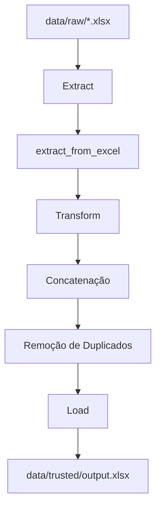
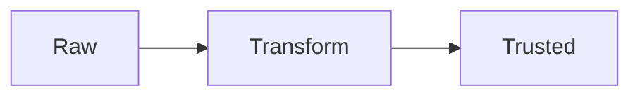
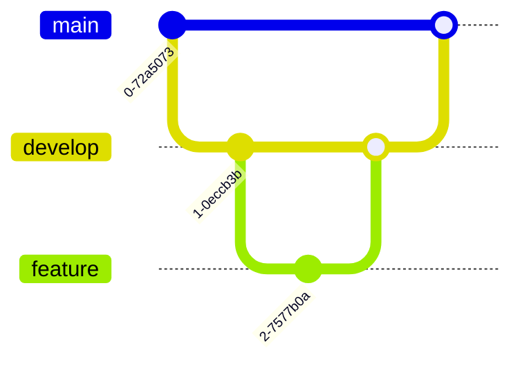

# Sales ETL Pipeline

Pipeline ETL desenvolvido em Python para consolidação automatizada de dados de vendas de múltiplas lojas utilizando arquitetura em camadas (Raw → Trusted), testes automatizados, documentação técnica e boas práticas de engenharia de dados.

---

# Visão Geral

Este projeto simula um pipeline ETL moderno utilizado em ambientes de engenharia de dados.

O fluxo consiste em:

* Extração de arquivos Excel
* Consolidação de dados
* Tratamento e remoção de duplicidades
* Persistência dos dados tratados
* Testes automatizados
* Padronização de código
* Documentação técnica automatizada

---

# Tecnologias Utilizadas

## Linguagem

* Python 3.14

## Bibliotecas Principais

### Manipulação de Dados

* pandas
* openpyxl

### Banco de Dados

* sqlalchemy
* psycopg2-binary

### Logs

* loguru

### Variáveis de Ambiente

* python-dotenv

### Testes

* pytest

### Qualidade de Código

* black
* flake8
* isort
* pydocstyle
* pre-commit

### Automação

* taskipy

### Documentação

* mkdocs
* mkdocs-material
* mkdocstrings
* mermaid

---

# Arquitetura do Projeto

```text
sales-etl-pipeline/
│
├── data/
│   ├── raw/
│   ├── trusted/
│   └── error/
│
├── docs/
│
├── logs/
│
├── src/
│   ├── load/
│   ├── pipeline/
│   │   ├── extract.py
│   │   ├── transform.py
│   │   └── load.py
│   │
│   ├── tests/
│   │   ├── test_pipeline.py
│   │   └── test_request.py
│   │
│   ├── transform/
│   ├── utils/
│   │   └── generate_fake_data.py
│   │
│   └── main.py
│
├── .env
├── .gitignore
├── .pre-commit-config.yaml
├── mkdocs.yml
├── poetry.lock
├── pyproject.toml
└── README.md
```

---

# Fluxo ETL



---

# Funcionalidades

## Extract

Responsável por:

* Ler arquivos `.xlsx`
* Identificar múltiplos arquivos
* Retornar lista de DataFrames

---

## Transform

Responsável por:

* Consolidar múltiplos DataFrames
* Remover registros duplicados
* Padronizar dados

---

## Load

Responsável por:

* Persistir os dados tratados
* Salvar arquivo consolidado
* Criar diretórios automaticamente

---

# Como Executar o Projeto

## 1. Clonar o Repositório

```bash
git clone https://github.com/eduardohnsantos/sales-etl-pipeline.git
```

---

## 2. Entrar no Projeto

```bash
cd sales-etl-pipeline
```

---

## 3. Instalar Poetry

Documentação oficial:

[https://python-poetry.org/docs/](https://python-poetry.org/docs/)

---

## 4. Instalar Dependências

```bash
poetry install
```

---

## 5. Ativar Ambiente Virtual

```bash
poetry env activate
```

---

# Executando o Pipeline

```bash
poetry run python src/main.py
```

---

# Gerando Dados Fakes

```bash
poetry run python src/utils/generate_fake_data.py
```

---

# Executando Testes

```bash
pytest -v
```

---

# Qualidade de Código

## Black

```bash
black .
```

---

## Isort

```bash
isort .
```

---

## Flake8

```bash
flake8 .
```

---

## Pydocstyle

```bash
pydocstyle src/
```

---

# Pre-commit

## Instalar Hooks

```bash
pre-commit install
```

---

## Executar Manualmente

```bash
pre-commit run --all-files
```

---

# Taskipy

## Executar Pipeline

```bash
task run
```

---

## Executar Testes

```bash
task test
```

---

## Executar Formatação

```bash
task format
```

---

## Executar Linter

```bash
task lint
```

---

# Documentação com MkDocs

## Subir Servidor Local

```bash
mkdocs serve
```

---

## Build da Documentação

```bash
mkdocs build
```

---

# Exemplo de Documentação Mermaid

````markdown

````

---

# Testes Automatizados

O projeto utiliza:

* pytest
* validação de concatenação
* testes unitários
* validação de requests

---

# Boas Práticas Aplicadas

* Estrutura modular
* Pipeline em camadas
* Versionamento Git
* Git Flow
* Pull Requests
* Testes automatizados
* Documentação técnica
* Padronização de código
* Automação de tarefas
* Hooks de validação

---

# Melhorias Futuras

* Integração com PostgreSQL
* Agendamento com Airflow
* Deploy em nuvem
* Integração com Docker
* Monitoramento do pipeline
* Logs estruturados
* Integração com APIs
* Incremental Load
* Data Quality

---

# Exemplo de Pipeline Automatizado


---

# Git Flow Utilizado



---

# Autor

Eduardo Henrique Santos

GitHub:

[https://github.com/eduardohnsantos](https://github.com/eduardohnsantos)

---

# Licença

Este projeto é destinado para fins educacionais e demonstração de portfólio.
