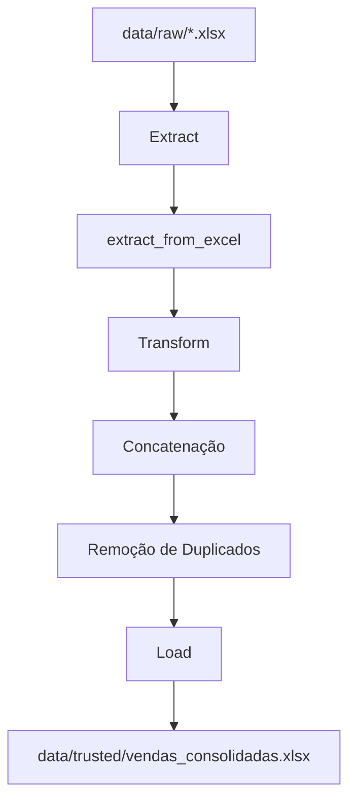

# Sales ETL Pipeline

Pipeline ETL para consolidação de vendas multi-lojas utilizando Python, Pandas, Poetry e MkDocs.

---

## Arquitetura do Pipeline



---

## Fluxo ETL

### Extract
Responsável por ler múltiplos arquivos Excel da camada raw.

### Transform
Responsável por:
- concatenar os dados
- remover duplicados
- padronizar informações

### Load
Responsável por salvar os dados tratados na camada trusted.

---

## Estrutura do Projeto

```text
sales-etl-pipeline/
│
├── data/
│   ├── raw/
│   ├── trusted/
│   └── error/
│
├── src/
│   ├── pipeline/
│   │   ├── extract.py
│   │   ├── transform.py
│   │   └── load.py
│   │
│   ├── tests/
│   └── main.py
│
├── docs/
├── mkdocs.yml
├── pyproject.toml
└── README.md
```

---

## Função de Extração

::: pipeline.extract.extract_from_excel

---

## Função de Transformação

::: pipeline.transform.contact_data_frames

---

## Função de Load

::: pipeline.load.load_excel